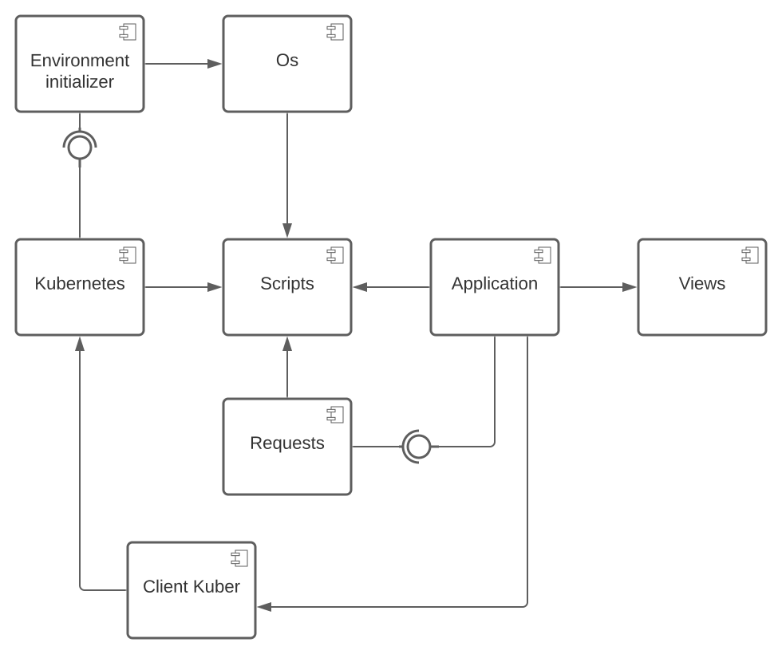

# ConsoleAppStore

## Component diagram and their description

### Os

A wrapper to interact with the operating system (in this case `Ubuntu`):

> Executes scripts to install addons;

> Executes scripts to remove addons.

All scripts are run in interactive mode.

### Scripts

Wrapper for working with scripts:

> Provides a place to save scripts;

> Deletes the script from the repository by name;

> Provides a list of scripts;

> Provides the script by name.

### Views

Responsible for working with the `TUI`. Implements methods:

> `Init` - to initialize the initial mapping;

> `Update` - to update the display as a result of a user action;

> `View` - to display the interface.

### Requests

Responsible for queries to `Git`, where all scripts are stored:

> `Get` - query. Get all the scripts with their descriptions that are in the repository;

> `Download` - query. Load the script into the local storage.

### Environment initializer

Responsible for installing, configuring and uninstalling `Kubernetes` from the user's machine.

### Client Kuber

Component providing interaction with the `Kubernetes` cluster.

### Kubernetes

The `Kubernetes` contains an extended application.

### Application

A component that contains all of the application's business logic.
